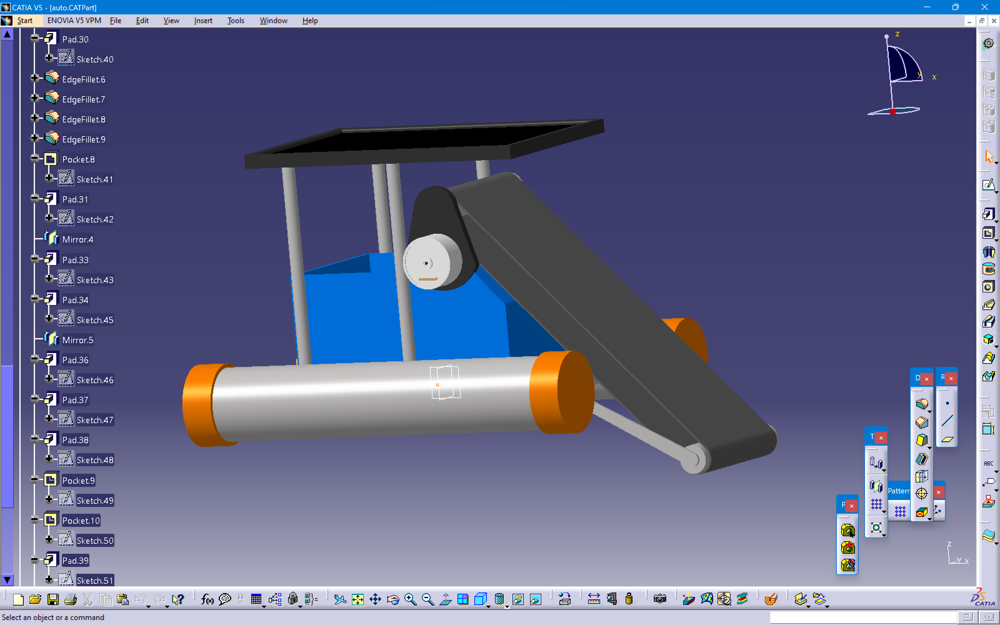
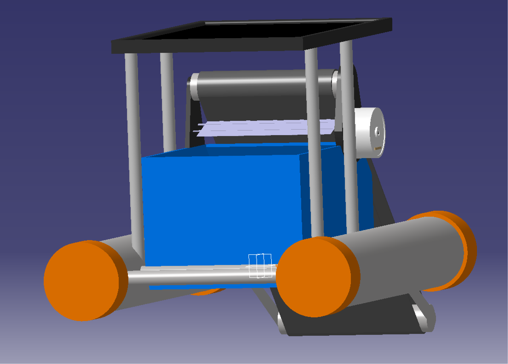
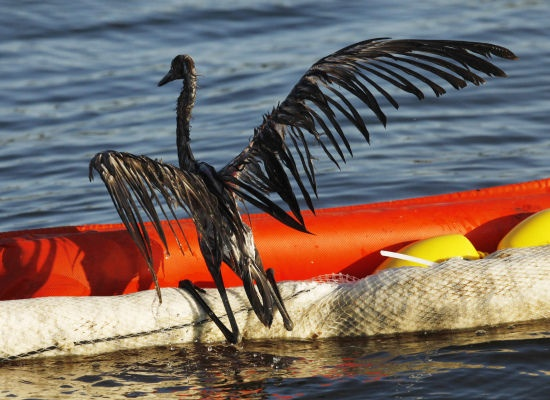

# 🌊 IoT-Based Solar-Powered Oil Skimmer

## 🧭 Overview
This project presents an **IoT-enabled, solar-powered oil skimmer** designed to recover **spilled crude oil from ocean surfaces** efficiently and sustainably. Oil spills cause severe damage to marine life and the environment. This system provides an **eco-friendly, automated, and cost-effective** solution to clean up oil-contaminated water using **renewable energy and smart control**.

  
  

---
## ⚙️ System Description
The **oil skimmer** works on the principle of **adhesion**, where oil sticks to a rotating belt or disk and is then scraped off into a collection tank.  
The device uses **solar energy** to power an **Arduino-based control system** that drives DC motors for propulsion, steering, and oil collection.

The prototype is **controlled via Bluetooth**, allowing remote operation using a smartphone app. For future upgrades, an **ESP32 module** is planned to provide **IoT connectivity**, enabling cloud-based monitoring and autonomous control.

---
## Traditional Way

  
  
  
  

---

## 🔋 Key Components
- **Arduino Mega** – Main controller  
- **HC-05 Bluetooth Module** – Wireless control  
- **Solar Panel (30W)** – Renewable power source  
- **Li-ion Battery (15V)** – Energy storage  
- **DC Motors & Motor Driver** – For propulsion and belt drive  
- **Polyurethane Belt** – Collects oil from the water surface  
- **Separator Tank** – Separates and stores collected oil  
- **Ultrasonic Sensors** – For obstacle detection (optional)  
- **ESP32 Module (Future Upgrade)** – Enables IoT-based monitoring  
---

## 🧩 Working Principle
1. Solar panels charge the onboard battery.  
2. The Arduino controls the DC motors via Bluetooth.  
3. The rotating **polyurethane belt** collects oil from the surface.  
4. The belt passes through a **separator tank**, where oil is wiped and stored.  
5. Clean water is released back into the ocean.  

---

## 🧠 Features
- Solar-powered, eco-friendly operation  
- Bluetooth-based remote control  
- Real-time monitoring (future IoT upgrade)  
- Efficient oil-water separation  
- Low-cost and portable design  
- Protects marine ecosystems from pollution  
---

## 📊 Performance
- **Oil Removal Rate:** 87.5 ml/min  
- **Efficiency:** 96.5%  
- **Power:** 12V DC motor (1440 RPM max)  
- **Material Cost:** ₹14,668 (approx.)  
---
## 🌎 Marine Ecosystem Guardian

Oil spills pose one of the greatest threats to marine ecosystems, causing long-term damage to aquatic life, coral reefs, and coastal habitats. The IoT-Based Solar-Powered Oil Skimmer acts as a Marine Ecosystem Guardian, helping to protect and restore ocean health through sustainable technology.

By efficiently removing oil and grease from the water surface, the system:

- Prevents suffocation of fish and aquatic organisms

- Reduces toxic contamination of coral reefs and coastal zones

- Helps restore oxygen balance in marine environments

- Ensures safer conditions for birds and marine mammals

- Supports sustainable fishing and clean coastal tourism

Unlike conventional cleanup systems, this project uses solar energy and smart control mechanisms to operate continuously without adding pollution back into the environment.
It stands as a symbol of how renewable technology and IoT innovation can work together to preserve marine biodiversity and promote a cleaner, safer planet for future generations.

  
  
  
  
  
  

---

## 🚀 Future Scope
- Integration of **ESP32** for IoT and cloud connectivity  
- Addition of **AI-based path optimization**  
- Use of **machine learning** for oil detection and adaptive skimming  
- Integration with **autonomous surface vehicles** for larger coverage  
---

## 📚 Authors
**Project Title:** IoT-Based Solar-Powered Oil Skimmer  
**Team:**   
👨🏻‍🎓 Kartik Ugale,    
👨🏻‍🎓 Mayur Tajane,    
👨🏻‍🎓 Suraj Shinde,    
👨🏻‍🎓 Aniket Tanpure  
**Host:** B.E. Mechanical Students, Amrutvahini College of Engineering, Sangamner  
**Session:** 2023–24  
